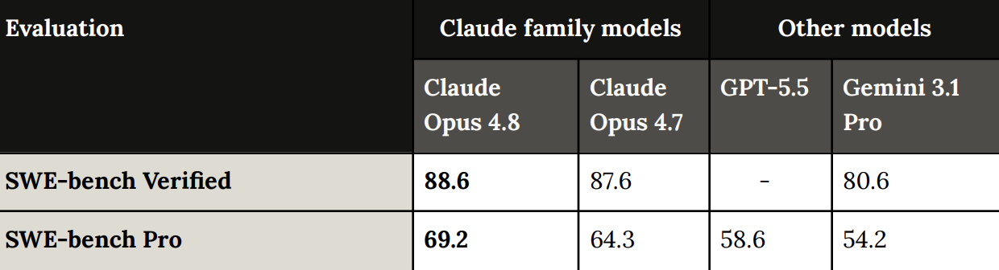
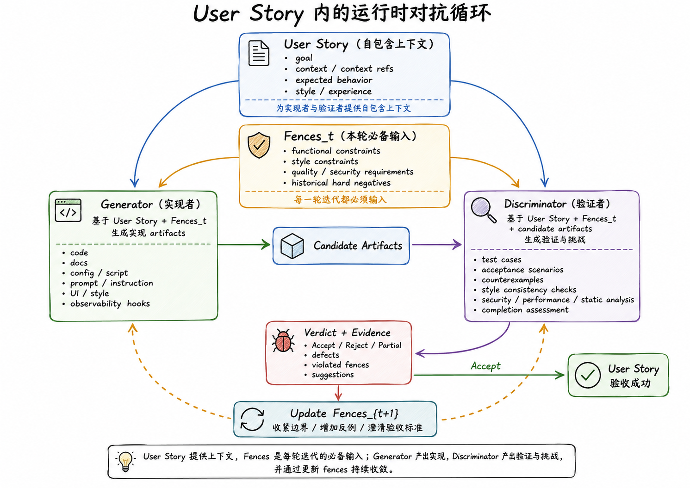
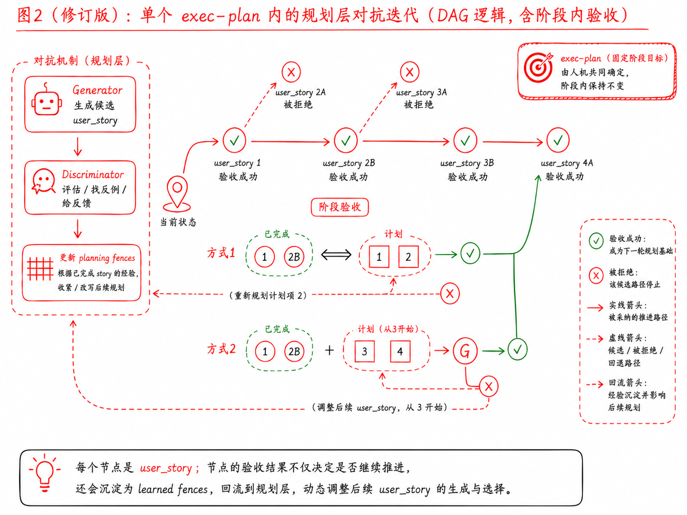
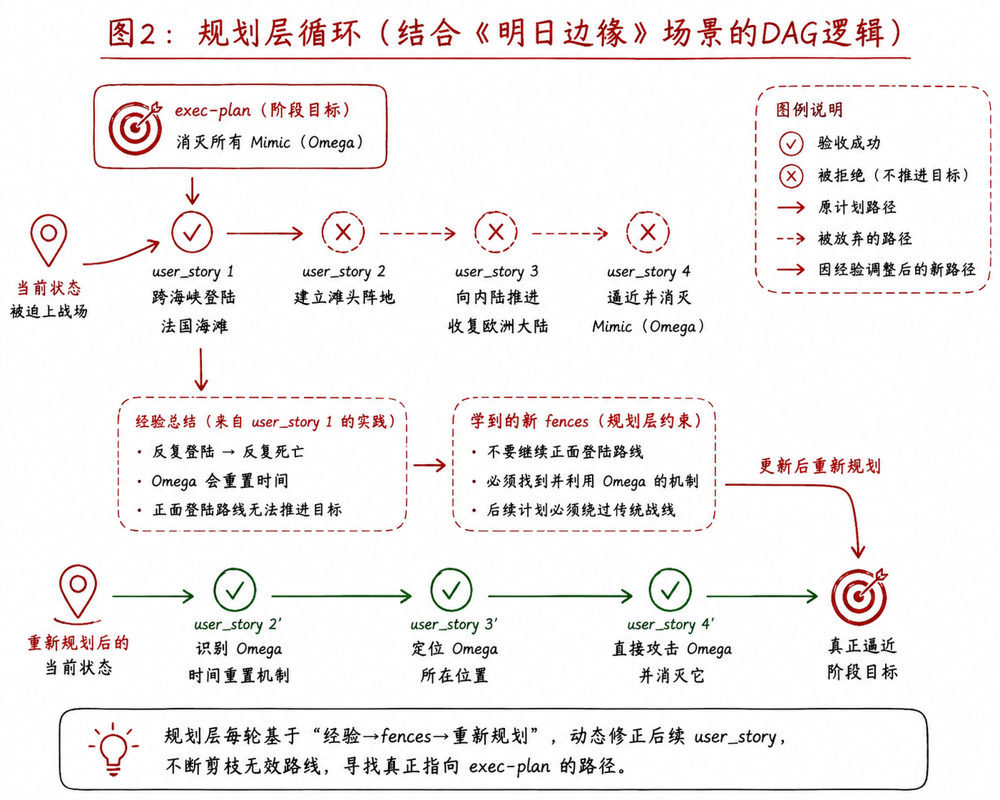
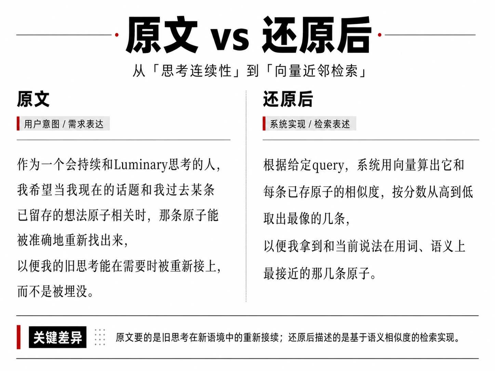
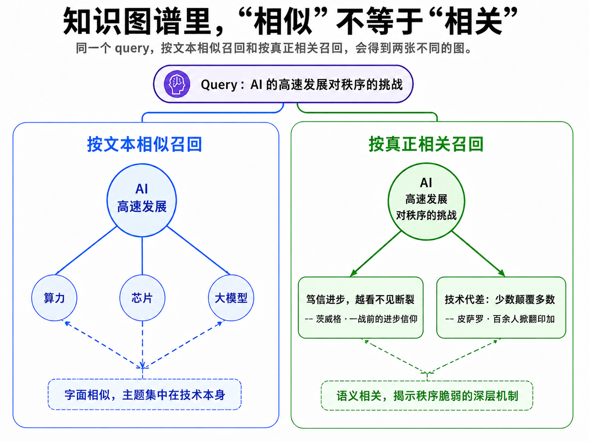

+++
title = '跳出个例：Agent的对抗式敏捷闭环'
date = 2026-06-01T20:02:20+08:00
lastmod = 2026-06-21T11:15:00+08:00
draft = false
slug = 'adversarial-agile-loop'
description = '一种面向长时Agent任务的对抗式敏捷闭环：借敏捷开发的方式拆解任务，从失败中提炼出规则边界以提升迭代质量'
summary = '长时Agent常陷入低效循环——不断收集失败却无法沉淀出可复用的规则。本文在Anthropic的Planner–Generator–Evaluator架构和Ralph Loop基础上，引入敏捷开发的user story等作为最小可观测航点，通过对抗式评估和语义残差回传，把失败转化为下一轮的显式约束，提高Agent从失败中学习的效率。'
tags = ['agent-harness', 'agile', 'adversarial', 'bdd', 'long-running-agents']
categories = ['AI', 'Agents']
license = 'cc-by-nc-sa'
+++

随着Codex、Claude Code中/goal这类面向长时任务和自主执行能力的普及，Agent已经不再只是“单轮问答工具”，而开始进入更真实、更长链路的工程任务。

但在实践中，这类长时Agent仍然没法很好地解决“最后一公里”，花了大量的token和时间迭代出的成果却不如预期。更糟的是，迭代越多，引入了预期外的行为反而越多，本应省下的时间在最后的人工微调和对齐阶段还了回去。

这让我想起了阿汤哥的电影《明日边缘》，阿汤哥第一次上前线就惨烈牺牲，却因此意外获得了重生能力——每次死去，都会回到任务前一天的早晨。随着他一次又一次地在任务中阵亡，一遍遍重来：哪里会爆炸、该躲哪块钢板。他的战斗经验就越丰富，在战场上存活的时间也越久。

但问题是：即使他积累了再丰富的战斗技巧和经验，真的能打败外星生物吗？不一定。因为在沙滩上积累再多失败场景，解决再多的杂兵，也碰不到那个决定胜负的根本矛盾：同样能够重生的外星首脑"Omega"。

在现在的实践里，有不少是把循环中踩过的坑存成一个个corner case，不断的积累场景（few-shot examples），提醒模型"下次别这样"。

于是我开始思考有没有比"收集失败"更好的办法，让Agent真正从失败里学到能类比、能泛化的规则，从而避开同一类错误。

我们想要的，是借这些真实体验提炼出有深度的归因——把一个个例，升格成能挡住一整类错误的规则：为什么失败？这次失败暴露了哪条本该存在、却缺失的边界？这条边界要不要写进下一轮的约束？

否则我们只是在让Agent一遍遍上沙滩。

# 从Anthropic的三角色设计说起

随着harness engineering的普及，越来越多的研究方向开始涌现:
* 怎么设计product和design spec
* 如何管理和交接状态
* 如何控制和分解上下文
* 如何做tracing和eval
* 如何管理权限和沙箱
* 如何接入更真实的评测工具

Anthropic在[harness-design-long-running-apps](https://www.anthropic.com/engineering/harness-design-long-running-apps) 提出的对抗式多智能体系统，分为三个角色：

```text
规划层(Planner) -> 生成器(Generator) <-> 评估器(Evaluator)
```

规划层负责把高层产品意图扩展成可实现的产品特性(feature list)和产品契约(product specs)，生成器负责在契约范围内实现，而评估器需要像真实用户一样指出问题（找茬），尽可能全面的评估产品在不同维度(UI, API, DB)的质量。

## 不止是Ralph Loop

上面设计中每一块都在逐渐系统化，走向成熟，尤其当评估器接上更多的真实评估工具之后，它不再只是“想象”这个功能完成了，而是开始把“想象”变成现实中的“体验”, 像给“缸中之脑”接上神经反馈。

Geoffrey Huntley在[Ralph](https://ghuntley.com/ralph/)更早提出这类观点，把他开发的智能体比作《辛普森一家》里的Ralph Wiggum：
> 他很会搭游乐场，自己玩起来却总是鼻青脸肿地回家——于是得在滑梯旁立上标语，提示他下次别再这么干。

但当我把这些思路落实到luminary agent的开发实践中发现：评估器虽然得到了更多的真实反馈，但下一轮生成器仍可能会在同类问题上犯错。评估器越来越像一个测试工具和案例集合，能告诉你哪里坏了，却不一定能有效地告诉你为什么坏。

于是我开始关心另一个问题：**怎么减少Agent在迭代中的盲目试错**。

这里应该有一个重要的闭环：

```text
失败体验 -> 错误归因 -> 沉淀规则边界 (Fence) -> 避免同类错误
```

| 体验 |  | 规则边界 |
| :--- | :---: | :--- |
| 记录这一次发生了什么 | → | 约束以后不能做什么 |
| 只盖住这个个例 | → | 挡住一整类错误 |
| 一条可参考的例子 | → | 一道不可越过的红线 |

当Ralph摔倒后，加上<SLIDE DOWN, DON’T JUMP, LOOK AROUND>的标语也许能避免从滑梯摔下来，但谁知道他下次不会站在栏杆上呢。


我们需要一种方法，能够从这些loop的真实体验中找到失败的原因，从而根本上来提高Ralph的“安全意识”。

但要让“体验 -> 归因 -> 边界”的闭环转起来，得先解决一个更基础的问题：拿什么作为归因的尺子——一个足够小、可观测的语义单位，能让"目标"和"产出"放进同一个坐标系。先有尺子，才量得出每次到底偏在哪、该沉淀成什么规则。于是我想到从敏捷开发中借这把尺子。

# 敏捷闭环的Agent架构

从Prompt Engineering -> Context Engineering -> Harness Engineering, 随着基座模型能力的提升，Agent的设计方式已经越来越接近真实的软件团队。

而敏捷开发的Behavior Driven Development(BDD)似乎和现在的Agent有着天然的契合，都擅长化繁为简和快速迭代。

传统的开发思维让我对确定性有种执着，试图事无巨细仿佛构造一块精密的瑞士手表。但在Agent开发的世界中并不存在完美的契约(spec)能一劳永逸地解决所有问题。

需求、上下文、风格、验收标准……这些契约越写越像百科全书。

而agent要背着重重的书集赶路，什么都带着，却不知道现在该看哪一页。

## 比起试图定义每一步，定义最小可观测航点

也正因为模型能力的提升，对于清晰定义的任务(如SWE-bench Verified)通过率已经~**90%**，这证明了执行层基本不再是瓶颈，而契约如何定义和拆解才真正决定了任务的完成质量。


敏捷开发的尺子已经提供了一套成熟的方法论来拆分和跟进：
```text
product goal（全局目标） -> sprint goal（冲刺的阶段目标） -> user story（阶段目标的可观测拆分）
```

和[Harness Design - Anthropic](https://www.anthropic.com/engineering/harness-design-long-running-apps)实践不同，我刻意保留了阶段目标(sprint)作为追踪目标是否偏移的证据。而正如OpenAI在[Harness Engineering](https://openai.com/index/harness-engineering)中所说:
> 情境是一种稀缺资源

每一次偏离应该作为下一次调优生成器/评估器的黄金机会。

`user story` 作为在工程实践中的广泛应用和其优秀的可读性，又能映射到不同维度的输出：代码、文档、UI……在这里作为**最小语义观测点**。后面这套循环、评估和残差，都是围绕这个观测点展开的。

## 动态的双层对抗式Loop

相比于一次就规划好所有要做的feature_list，闭环应该是动态演进且可以敏捷修正的。

所以和 Anthropic 的单层三角色相比，我们的系统把对抗拆成了两层：
```text
Planner <-> Evaluator -> Generator <-> Evaluator
```

外层是规划层，让规划层和评估器对抗，保证航线不偏；内层是执行层，让生成器和评估器对抗，保证每个航点真正落地。下面分别来看：

### 执行层循环


在这里，对抗发生在user story内部。生成器和评估器拿到的是同一份输入：自包含的user story（目标、上下文、期望行为、风格），加上 Fences_t——之前的循环里沉淀下来的约束边界。生成器据此产出候选artifacts（代码、文档、配置、UI……），评估器则独立地"找茬"：跑测试、构造反例、检查风格一致性与安全性能。

关键在于，评估器给出的不只是Accept/Reject，而是带证据的裁决：缺陷在哪、违反了哪条约束、离目标还差多少。失败的体验经过归因，沉淀成更新后的 Fences_{t+1}，下一轮生成器就在更紧的边界里重试。这正是"体验 → 归因 → 边界"在运行时的样子——每次失败都让边界收紧一点。

验收通过后，这轮产出物还要压缩成一份验收报告向上汇报：用作和阶段目标（sprint goal）的比对，来帮助规划层动态修正航线。

### 规划层动态迭代


如果说执行层是在一个航点（user story）内部收紧边界；规划层关心的则是另一件事：这些航点该怎么连成航线，偏航了又怎么改道。

和一次就把航线画死的线性计划不同，这里的sprint-goal是一张动态的航点网（见上图）。每抵达一个航点，都要做一次阶段内验收——它不只看"这一段飞得对不对"，还要回答"照现在的真实位置，沿这条航线走下去，还到得了目的地吗"。于是验收分成两个问题：

| 验收 | | 问什么 | | 不通过意味着 |
| :--- | :--- | :--- | :--- | :--- |
| **R_integration** | | 完成的"航线"**合在一起**还自洽吗？ | | 各块互相踩踏、接口对不上，或组合起来才触犯某条跨模块红线 |
| **R_coverage** | | **真实成果 + 剩余计划**，还能达成阶段目标吗？ | | 按真实产出算（而非计划「本该产出」），可能已经凑不齐 |


### 明日边缘：当航线本身错了

盟军的作战计划，就是图里上排那条线性航线：登陆法国海滩 → 建立滩头阵地 → 向内陆推进收复欧洲 → 最终消灭外星生物。阿汤哥在这条航线上却一次次重来——正面反攻这条路从结构上就通不到Omega。



转机不在他打得更好，而在反复重生让他攒下几条写给规划层的约束：正面战线永无止尽，Omega会重置时间。规划层据此剪枝改道：放弃正面战争，改成 2′ 摸清时间重置机制 → 3′ 定位Omega真身 → 4′ 直插消灭它——这条新航线才真正指向终点。这正是规划层在`R_coverage`不通过时做的事：
> 不是再试一次，而是调整航线。

### 评估器：用**反向还原**进行归因
前面提过，一个重要的环节是生成器和评估器的对抗式收敛，而不是盲目试错。

虽然评估器接上验收工具拿到真实信号后，一定程度上可以帮助找到"硬边界"来约束生成器蒙混过关的空子。

但这种信号有天花板：我们没法为每一个维度的标准都构造一个测试工具，user story里大量隐含的意图——体验、风格、业务语义——大多没有现成工具能测。

好比一个多维魔方，这次把“测试”这一面拧齐，生成器打个补丁；下一次又发现“风格”那一面乱了，更别说那些压根没被定义的面，你连它乱没乱都看不见。

另一办法是构建"软约束"，让对抗回到语义层。评估器把这一轮的产出物反向还原成原始目标的形式——"光看这些代码、配置、文档，Agent到底想做什么？"
> 从产出物本身倒推意图，再和真实的输入进行比对，从而更好的归因。

这种"蒙着标准答案、从产出物倒推意图"的比较，也是参考了GAN风格的对抗，旨在照出工具覆盖不到的那些维度。而总结又恰恰是LLM最擅长的事之一，我们甚至可以用相对较弱的开源模型来监督和scale。

**让我们来看一个例子，Luminary有个内层US-0：【召回相关想法原子】**

生成器做得很称职：上了向量、调了打分、写了单测，还贴心处理了缓存损坏时的退化。测试全绿。测试用的话题想法原子（atom）也被轻松召回；

可评估器没停在"测试过了"。它开始做反向还原：光看这些产出物，它在交付什么？



这乍一看和US-0中的需求是一回事，但仔细看，原始目标要的是"相关"，可实现时把"相关"变成了"相似"。两者大多数时候重合，所以测试全过；但偏偏在最关键处分叉：当一条之前的想法意思相关、说法迥异，文本相似度理所当然的会把它判成不相关，于是最怕的"被埋没"发生了。



比如我正在聊"AI高速发展对秩序的挑战"——按文本相似召回，捞上来的全是"像AI"的近邻：算力、芯片、大模型，虽是同类题材内容但却并不能帮助启发。右边的相关召回，顺着"技术加速 → 旧秩序承压"这条结构往下走，接上的是两条字面毫不沾边的历史“原子”：茨威格笔下那个自信永不崩塌、却一夜碎掉的战前欧洲（稳定幻觉），和皮萨罗用百来人掀翻印加帝国（关键从不在人多，而在技术代差）。这两条和"AI"字面上毫不相干，却更能关联上眼前这点担忧，真正往下推了一步。

记忆之所以像在"联想"而不是"搜索"，靠的恰恰是那些“相关但不相似”的旧想法——类比、张力、被遗忘的反例。

## 最后

这篇文章源于开发Luminary和其他agent harness时的一点切身困扰：苦于agent开发的“最后一公里”总是不如预期，于是结合学习harness engineering的现状，记下这些思考和尝试。

说到底，无论是明日边缘的沙滩，还是Ralph的滑梯都是为了能提高agent迭代的质量，并且提高产出的可读性。

当然，这套尝试还有不少缺陷和难题：对抗过程中token开销的控制、内外层动态规划的设计、怎么让模型真正做到有效归因……

道阻且长，后续我也会继续在实践中打磨，并分享更新。


## References

1. [OpenAI: Harness Engineering](https://openai.com/index/harness-engineering)
2. [Anthropic: Effective harnesses for long-running agents](https://www.anthropic.com/engineering/effective-harnesses-for-long-running-agents)
3. [阿里云: 从玩具到生产力](https://mp.weixin.qq.com/s/xLdQ9Z3n3SNwaQtmrM28FA)
4. [OpenAI: Evals design and tooling](https://developers.openai.com/blog/eval-skills)
5. [Anthropic: Harness design for long-running apps](https://www.anthropic.com/engineering/harness-design-long-running-apps)
6. [LangChain: Agent evaluation readiness checklist](https://www.langchain.com/blog/agent-evaluation-readiness-checklist)
7. [Geoffrey Huntley: Ralph](https://ghuntley.com/ralph/)